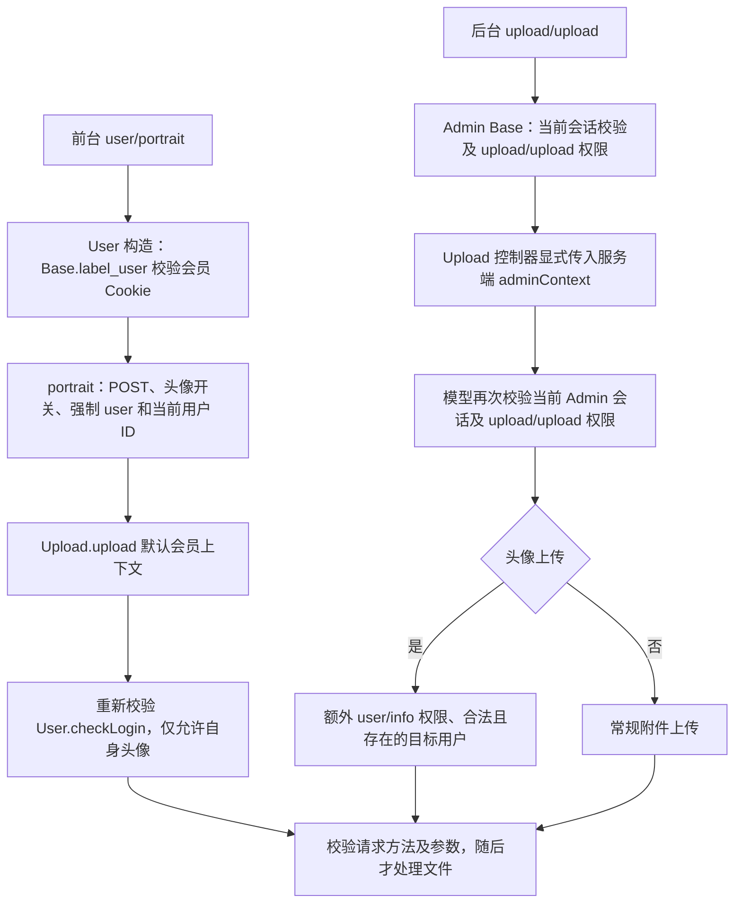

# 上传身份与归属（2026-09-10）

## 实际认证链

当前应用中，接收上传的 `Upload::upload()` 只有两个调用入口。`Upload::api()` 是图片下载/封面生成之后的内部存储转投方法，本组没有把它改为上传身份入口。当前 API 控制器没有独立头像/文件上传写动作；API 的 `user_portrait` 引用是资料读取。



前台原来的 `portrait()` 已经通过服务端覆盖 `flag` 和 `user_id`，不能把独立调用模型时的漏洞误报为匿名公网任意头像覆盖。模型原先完全依赖调用方和 `$GLOBALS['user']`，本组增加独立校验，避免后续入口或错误调用把展示用的全局身份当作授权。

## 已确认问题及修复

1. 后台已有 `upload/upload` 权限的管理员可以提交 `flag=user&user_id=其他会员`，直接覆盖该会员的固定 JPEG 文件，原来没有要求 `user/info` 权限。更严重的是，模型文件目标来自请求 `user_id`，资料更新却使用 `$GLOBALS['user']['user_id']`，后台该全局会员通常不存在，或与目标不同。修复后，模型重新验证当前后台会话、上传权限和会员编辑权限，核对目标存在，文件名和资料更新统一使用该目标 ID，支持实际 UINT32 用户 ID 上限。
2. 模型新增显式的服务端管理员上下文，只由后台 Upload 动作传入。请求中的 `adminContext/admin_context/admin/is_admin` 不参与身份决策。普通会员始终重新校验 Cookie/JWT，只能上传自己的头像，头像开关必须开启，不能选择其他目录或编辑器 `from`。请求覆盖参数无法授予后台权限；有效会员身份与伪造/过期全局身份不一致时拒绝处理。
3. `from/input/flag/thumb/thumb_class/user_id/action/ueditor_theme` 的数组等错误容器曾可触发字符串处理、类名拼接或取模错误。现在先校验容器、规范目录和文件字段标识及长度；不再把目录穿越字符串静默删字符后当作合法目录。`from` 仅允许当前安装的五种编辑器和空值。
4. 实际文件上传只允许 POST。已鉴权且有上传权限的 UEditor/UMeditor `action=config` 保留 GET 配置读取，普通会员、游客、已撤权管理员和 GET 上传动作不能借该例外处理文件。

权限键处理与当前后台规则一致：控制器名忽略下划线及大小写，动作名仅忽略大小写和查询后缀，完整匹配权限项。`otherupload/upload`、`newuser/info`、`user/info_extra`、`user/in_fo` 均不能替代所需权限。

本组仅修改 `common/model/Upload.php` 和 `admin/controller/Upload.php`。未修改 User、API 控制器、存储 SDK、头像转换方式或图片依赖。原先正常前台头像、后台内容附件、管理员编辑会员头像以及五种编辑器正常上传均保留。

## 回归与环境

`tests/security_audit_upload_identity.php` 使用真实 User/Admin/Group/Annex 模型和 Think ORM、真实 Cookie/JWT 校验、真实 Request 参数及文件解析、UploadedFile 移动、图片解码和临时文件。仅页面/后台构造壳被隔离，以避免启动原工作区应用；模型身份守卫没有替换。CLI 上传文件只设置框架明确提供的 `UploadedFile` 测试标志，不替换生产授权逻辑。

MySQL fixture 使用当前安装 DDL，数据库固定为独立 `maccms_audit_upload`，表前缀 `upload_audit_`，不占用会员资金 fixture 库。开关是 `UPLOAD_AUDIT_MYSQL=1`，连接覆盖参数为 `UPLOAD_AUDIT_HOST/PASSWORD`。新测试分别在 `ENTRANCE=index` 和 `admin` 两种返回格式下执行相同身份矩阵，证明展示格式不能改变服务端上下文权限。

| 回归 | PHP 8.3 | PHP 8.4 |
| --- | ---: | ---: |
| 上传身份 / SQLite / 前台格式 | 203 | 203 |
| 上传身份 / SQLite / 后台格式 | 203 | 203 |
| 上传身份 / 真实 MySQL / 前台格式 | 203 | 203 |
| 上传身份 / 真实 MySQL / 后台格式 | 203 | 203 |
| 既有图片上传链 | 38 | 38 |
| 既有图片处理链 | 111 | 111 |

身份矩阵包括无凭据、伪造全局身份、会员越权目标/目录/from、伪造管理员参数、错误数组/内部覆盖参数、非 POST、关闭头像、Cookie/JWT 失效、账户停用/改名/删除、管理员撤权/改密/删除、权限项误匹配、无效/不存在/UINT32 上限目标，以及真实控制器正常上传后的目标文件、会员资料和附件记录一致性。拒绝请求前后比较用户资料、附件记录和上传目录内文件/目录，确认未移动上传文件或覆盖头像。

真实编辑器 `front/back` 会输出 JSON 后退出，因此通过十个独立 SQLite 子进程验证授权配置 GET、游客/会员/撤权拒绝、GET 上传拒绝，以及 UEditor、UMeditor、Kindeditor、CKEditor、TinyMCE 正常文件上传响应；子进程退出前核对真实图片和附件记录并清理临时目录。未把该套件声称为完整后台 HTTP/CSRF 测试。

原 `security_audit_image_upload.php` 的图片专用元数据 fixture 现在明确提供合法会员/管理员 `checkLogin()` 结果并调用相应上下文，继续通过生产守卫；身份本身由新增真实 ORM 套件验证。

运行示例：

```sh
# 使用 PHP 8.3/8.4 及锁定的应用依赖、Imagick 3.8.1。
php tests/run_audit.php --suite=upload
# 指向已创建 maccms_audit_upload 的一次性 MySQL fixture。
UPLOAD_AUDIT_MYSQL=1 UPLOAD_AUDIT_HOST=127.0.0.1 UPLOAD_AUDIT_PASSWORD=fixture-password \
  php tests/run_audit.php --suite=upload
```

本地矩阵使用 `maccms-audit-image83:20260910` / `maccms-audit-image84:20260910`；默认 `upload` 套件同时覆盖前后台返回格式。全部文件操作位于独立临时目录，SQLite 运行禁网；MySQL 仅连接隔离容器。没有发送远程上传/抓取请求，没有使用真实用户文件。日志：`/tmp/maccms-audit-20260910/upload-identity/`。

## 紧接的独立问题

* **CSRF 尚未闭合。** 现有配置包含 `security_csrf_admin_exempt=upload/*`，前台头像也没有在本组增加 CSRF 令牌。POST 约束只是请求方法约束，不能当作 CSRF 防护。下一小组需要同步实际上传客户端并移除相应豁免；编辑器只读配置 GET 仍可独立保留。
* 文件替换、会员头像字段更新、Annex 新增以及可能的远程存储转投不是一个可回滚事务，现有写入失败处理仍需下一组完善；本组只保证授权目标一致，不宣称跨资源原子性。
* `common/extend/editor/Tinymce.php::back()` 在失败结果缺少 `data.file` 时仍直接读取该键，存在单独的失败响应健壮性问题。新增身份/参数拒绝使用普通受控 JSON，不经过这一分支；此旧适配器失败语义尚未修改。
